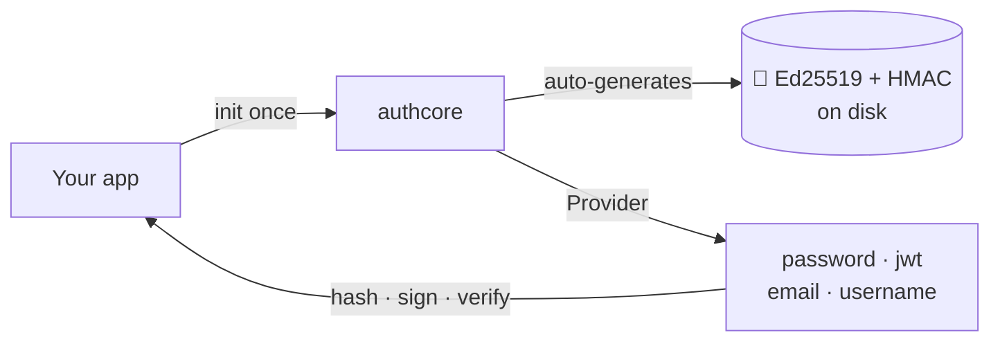

<div align="center">

# 🛡️ authcore

**Auth is the code you only get wrong once. authcore does the dangerous parts for you.**

Argon2id passwords · EdDSA tokens · refresh rotation · email + username validation —
secure by default, in pure Go. No database. No framework. No crypto PhD.


[](https://github.com/Glyndor/authcore/actions/workflows/ci.yml)
[](https://pkg.go.dev/github.com/Glyndor/authcore)
[](LICENSE)

[**Install**](#-install) · [**Quick start**](#-quick-start) · [**Why**](#-why) · [**Modules**](#-modules) · [**Examples**](examples/) · [**Docs**](docs/)

</div>

---

```go
// Without authcore — every line is a chance to leak or weaken something:
salt := make([]byte, 16); rand.Read(salt)               // right size? right RNG?
key := argon2.IDKey(pw, salt, 3, 64*1024, 2, 32)        // OWASP params? memorised?
stored := encodePHC(salt, key)                           // hand-rolled format…
if subtle.ConstantTimeCompare(a, b) == 1 { /* login */ } // remembered constant-time?
// …then generate Ed25519 keys, sign a JWT, hash + rotate refresh tokens, repeat.

// With authcore — secure defaults, nothing to get wrong:
hash, _ := pwd.Hash(password)                // Argon2id · salted · PHC-encoded
ok,   _ := pwd.Verify(attempt, hash)         // constant-time, always
pair, _ := tokens.CreateTokens(userID, claims) // EdDSA-signed access + refresh
```

## 📦 Install

```bash
go get github.com/Glyndor/authcore
```

Requires **Go 1.26+**. On first run, Ed25519 keys + an HMAC secret are generated
under `./.authcore/` — point `KeysDir` at a secrets volume in production.

## 🚀 Quick start

```go
// One-time setup at startup. Keys are created on first run.
auth, _ := authcore.New(authcore.DefaultConfig())

pwd, _    := password.New(auth)                          // Argon2id, OWASP defaults
tokens, _ := jwt.New[UserClaims](auth, jwt.DefaultConfig())

// Register: store only the hash, never the plaintext.
hash, err := pwd.Hash("Str0ng-P@ssword!")                // err == password.ErrWeakPassword tells the user why

// Log in: verify, then mint an access + refresh pair.
if ok, _ := pwd.Verify("Str0ng-P@ssword!", hash); ok {
    pair, _ := tokens.CreateTokens(userID, UserClaims{Role: "admin"})
    // pair.AccessToken      → Authorization: Bearer …
    // pair.RefreshTokenHash → store server-side (never the raw token)
    // pair.SessionID        → UUID v7, use as your session PK
}
```

> [!TIP]
> Full, runnable versions live in [`examples/`](examples/) — `go run ./examples/jwt/`.
> Wiring into a real HTTP stack: [Fiber](examples/fiber/) · [Gin](examples/gin/).

## ⚡ Why

Roll your own and own every footgun. Run a full identity platform for a login
form. Or reach for authcore — **the dangerous primitives, done right, in-process**.

| | Roll your own | Full IdP (Ory, Keycloak) | **authcore** |
|---|:---:|:---:|:---:|
| Time to first login | Hours – days | Hours (+ ops) | **~5 minutes** |
| Argon2id · EdDSA · timing-safe | Manual, easy to slip | ✅ | ✅ **by default** |
| Automatic key management | Manual | ✅ | ✅ |
| Database / HTTP server | You build it | Theirs (locked in) | **Bring your own** |
| Extra service to run | No | **Yes** | No |
| You own the data model | ✅ | ❌ | ✅ |

## 🔐 Modules

Pick only what you need — each is independent, testable, and safe by default.

| | Module | Does |
|---|---|---|
| 🔑 | **[password](docs/password.md)** | Hash + verify. Argon2id, policy-enforced, self-describing PHC format. |
| 🎫 | **[jwt](docs/jwt.md)** | Access + refresh tokens. EdDSA / Ed25519, generic claims, rotation. |
| 📧 | **[email](docs/validation.md)** | Validate + normalize. RFC 5321/5322, optional cached DNS MX check. |
| 👤 | **[username](docs/validation.md)** | Validate + normalize. Reserved-name blocklist, character rules. |
| 🗝️ | **[apikey](docs/apikey.md)** | Opaque API keys. Generate, keyed-hash for storage, constant-time verify. |
| 🌐 | **[oauth](docs/oauth.md)** | Social login — Google, Microsoft (OIDC) and GitHub, Discord (OAuth2). Auth Code + PKCE, ID-token validation or userinfo. |



## 📖 Docs

**New here? Start with the [Secure login recipe](docs/secure-login.md)** — the
step-by-step flow that turns these primitives into a login an auditor accepts.

[Secure login recipe](docs/secure-login.md) · [Password](docs/password.md) · [JWT](docs/jwt.md) · [Email & username](docs/validation.md) · [API keys](docs/apikey.md) · [OIDC login](docs/oauth.md) · [Key management](docs/key-management.md) · [Configuration](docs/configuration.md) · [Testing & modules](docs/testing.md) · [Migrating from bcrypt](docs/migrating.md) · [Errors](docs/errors.md) · [FAQ](docs/faq.md) · [Versioning](docs/versioning.md)

Full API reference on [pkg.go.dev](https://pkg.go.dev/github.com/Glyndor/authcore).

<details>
<summary><b>🗺️ Roadmap</b></summary>

Shipped: `password`, `jwt`, `email`, `username`, automatic key management.

Planned (no hard ETA): `apikey` (opaque keys + pluggable store), key-rotation
helpers, an optional access-token revocation hook, a pluggable key source
(KMS / env / in-memory), and `oauth` (OAuth2 / OIDC). Have a use case? Open an
[issue](https://github.com/Glyndor/authcore/issues).

</details>

## License

[Apache-2.0](LICENSE) — report vulnerabilities privately via the **Security** tab, never in a public issue.
