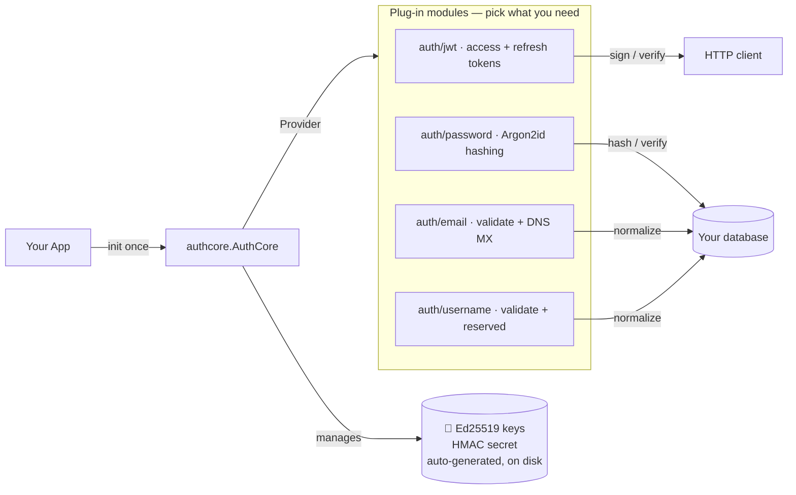

<div align="center">

# 🛡️ authcore

**Secure-by-default authentication primitives for Go — Argon2id passwords, EdDSA tokens, email + username validation. No database. No framework. No crypto expertise required.**


[](https://github.com/Glyndor/authcore/actions/workflows/ci.yml)
[](https://pkg.go.dev/github.com/Glyndor/authcore)
[](LICENSE)

[**Quick start**](#-quick-start) · [**Why**](#-why) · [**Modules**](#-modules) · [**Examples**](examples/) · [**API docs**](https://pkg.go.dev/github.com/Glyndor/authcore) · [**Docs**](docs/)



</div>

---

## 📦 Install

```bash
go get github.com/Glyndor/authcore
```

Requires **Go 1.26+**. No database, no HTTP framework — you plug those in. On
first run, Ed25519 keys + an HMAC secret are generated under `./.authcore/`.

## 🚀 Quick start

```go
package main

import (
    "log"

    "github.com/Glyndor/authcore"
    "github.com/Glyndor/authcore/auth/jwt"
    "github.com/Glyndor/authcore/auth/password"
)

type UserClaims struct {
    Name string `json:"name"`
    Role string `json:"role"`
}

func main() {
    // 1. One-time setup at startup (generates keys on first run).
    auth, err := authcore.New(authcore.DefaultConfig())
    if err != nil {
        log.Fatal(err)
    }

    // 2. Password hashing — zero config, OWASP-recommended Argon2id defaults.
    pwdMod, err := password.New(auth)
    if err != nil {
        log.Fatal(err)
    }

    // 3. JWT tokens — set issuer + audience to your service URL in production.
    jwtMod, err := jwt.New[UserClaims](auth, jwt.DefaultConfig())
    if err != nil {
        log.Fatal(err)
    }

    // Registration: hash the plaintext, store only the hash.
    hash, err := pwdMod.Hash("Str0ng-P@ssword!")
    if err != nil {
        log.Fatal(err) // e.g. password.ErrWeakPassword — surface the reason
    }

    // Login: verify the submitted password, then issue a token pair.
    if ok, _ := pwdMod.Verify("Str0ng-P@ssword!", hash); !ok {
        log.Fatal("wrong password")
    }

    // subject must be a UUID v7 — generate it anywhere in your app.
    pair, err := jwtMod.CreateTokens("019600ab-1234-7000-8000-000000000001",
        UserClaims{Name: "Ana", Role: "admin"})
    if err != nil {
        log.Fatal(err)
    }

    // pair.AccessToken      → send as `Authorization: Bearer <token>`
    // pair.RefreshTokenHash → store server-side (never the raw refresh token)
    // pair.SessionID        → UUID v7 shared by both tokens — use as session PK
    _ = pair
}
```

> [!TIP]
> Every module has a runnable example — `go run ./examples/jwt/` to see it
> end-to-end. See [`examples/`](examples/).

## ✨ Modules

| Module | Does | Import |
|---|---|---|
| 🔐 **jwt** | Sign + verify access/refresh tokens. EdDSA / Ed25519. Generic custom claims. Rotation. | `…/auth/jwt` |
| 🔑 **password** | Hash + verify. Argon2id. Policy enforced. PHC format (self-describing). | `…/auth/password` |
| 📧 **email** | Validate + normalize. RFC 5321/5322. Optional cached DNS MX check. | `…/auth/email` |
| 👤 **username** | Validate + normalize. Reserved-name blocklist. Character rules. | `…/auth/username` |

Each module is independent, testable, and safe by default — mix and match.
Full guides: [JWT](docs/jwt.md) · [Password](docs/password.md) · [Validation](docs/validation.md).

## ⚡ Why

Password storage, token signing and timing-safe comparison are the things you
only get wrong once. A full identity platform is a lot of surface area for a
login form. authcore sits in the middle: **a small library that does the
dangerous parts for you** and leaves the data model and HTTP to your app.

| | Roll your own | Full IdP (Ory, Keycloak) | **authcore** |
|---|:---:|:---:|:---:|
| Time to first login | Hours – days | Hours (with ops) | **~5 minutes** |
| Database / HTTP server | You build it | Theirs | **Bring your own** |
| Argon2id + EdDSA + timing-safe | Manual | ✅ | ✅ |
| Automatic key management | Manual | ✅ | ✅ |
| Runs in-process, no extra service | ✅ | ❌ | ✅ |
| You own the data model | ✅ | ❌ | ✅ |

## 📖 Docs

[JWT](docs/jwt.md) · [Password hashing](docs/password.md) · [Email & username](docs/validation.md) · [Key management](docs/key-management.md) · [Configuration & logging](docs/configuration.md) · [Testing & writing modules](docs/testing.md) · [Migrating from bcrypt](docs/migrating.md) · [Errors](docs/errors.md) · [FAQ](docs/faq.md) · [Versioning](docs/versioning.md)

Full API reference on [pkg.go.dev](https://pkg.go.dev/github.com/Glyndor/authcore).

## 🗺️ Roadmap

Shipped: `auth/jwt`, `auth/password`, `auth/email`, `auth/username`, automatic
key management. Planned (no hard ETA): `auth/apikey` (opaque keys + pluggable
store), key-rotation helpers, an optional access-token revocation hook, a
pluggable key source (KMS/env/in-memory), and `auth/oauth` (OAuth2/OIDC). Have a
use case? Open an [issue](https://github.com/Glyndor/authcore/issues).

## License

[Apache-2.0](LICENSE) — report vulnerabilities privately via the **Security** tab, never in a public issue.
