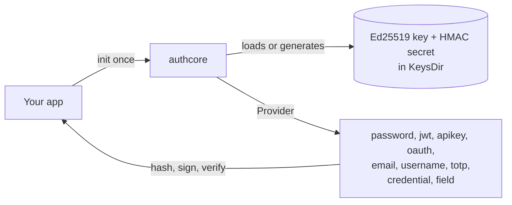

# authcore

Authentication library for Go: Argon2id password hashing, EdDSA access and refresh tokens with rotation, opaque API keys, TOTP, OIDC and OAuth2 social login, and email and username validation. It runs in your process and needs no database or framework.

[](https://github.com/Glyndor/authcore/actions/workflows/ci.yml)
[](https://pkg.go.dev/github.com/Glyndor/authcore)


```mermaid
flowchart LR
    App["Your app"] -->|init once| Core["authcore"]
    Core -->|loads or generates| Keys[("Ed25519 key + HMAC secret<br/>in KeysDir")]
    Core -->|Provider| M["password, jwt, apikey, oauth,<br/>email, username, totp,<br/>credential, field"]
    M -->|hash, sign, verify| App
```

authcore ships no HTTP server of its own; you wire the modules into your own stack.

## Modules

Each module is an independent package that takes the `Provider` and is usable on its own.

| | Module | Does |
|---|---|---|
| 🔑 | **[password](docs/password.md)** | Hash + verify. Argon2id, policy-enforced, self-describing PHC format. |
| 🎫 | **[jwt](docs/jwt.md)** | Access + refresh tokens. EdDSA / Ed25519, generic claims, refresh rotation, optional revocation through a denylist you implement. |
| 📧 | **[email](docs/validation.md)** | Validate + normalize. RFC 5321/5322, optional cached DNS MX check. |
| 👤 | **[username](docs/validation.md)** | Validate + normalize. Reserved-name blocklist, character rules. |
| 🗝️ | **[apikey](docs/apikey.md)** | Opaque API keys. Generate, keyed-hash for storage, constant-time verify. |
| 🔐 | **[totp](docs/totp.md)** | TOTP / RFC 6238 second factor. Enroll, verify, recovery codes; replay protection through a step recorder you implement. |
| ✉️ | **[credential](docs/credential.md)** | Tokens for password reset and account activation. Bound to a purpose and a subject, TTL enforced; your store makes them single-use. |
| 🛡️ | **[field](docs/field.md)** | Column encryption. AES-256-GCM plus an HMAC blind index, so a value stays searchable by equality without being readable. |
| 🌐 | **[oauth](docs/oauth.md)** | Social login: Google, Apple, Microsoft, Vercel (OIDC) and GitHub, Discord (OAuth2). Auth Code + PKCE, ID-token validation or userinfo. |

## Install

```bash
go get github.com/Glyndor/authcore
```

Requires **Go 1.26.6+**. On first run authcore writes an Ed25519 signing key and an HMAC refresh secret to `KeysDir` (default `.authcore/`); in production, point it at a mounted volume or provision the keys once with `authcore-keygen`. See [Key management](docs/key-management.md) and [Containers](docs/containers.md).

## Quick start

```go
// One-time setup at startup. Keys are created on first run.
auth, _ := authcore.New(authcore.DefaultConfig())

pwd, _    := password.New(auth)                          // Argon2id, OWASP defaults
tokens, _ := jwt.New[UserClaims](auth, jwt.DefaultConfig())

// Register: store only the hash, never the plaintext.
hash, err := pwd.Hash("Str0ng-P@ssword!")                // errors.Is(err, password.ErrWeakPassword) on a policy failure

// Log in: verify, then mint an access + refresh pair.
if ok, _ := pwd.Verify("Str0ng-P@ssword!", hash); ok {
    pair, _ := tokens.CreateTokens(userID, UserClaims{Role: "admin"})
    // pair.AccessToken      → Authorization: Bearer …
    // pair.RefreshTokenHash → store server-side (never the raw token)
    // pair.SessionID        → UUID v7, use as your session PK
}
```

> [!TIP]
> Full, runnable versions live in [`examples/`](examples/): `cd examples/jwt && go run .`.
> Wiring into a real HTTP stack: [Fiber](examples/fiber/), [Gin](examples/gin/).

## Sign-in providers

| Provider | Protocol | Build it with |
|---|---|---|
| Google | OIDC | `oauth.Google()` |
| Apple | OIDC | `oauth.Apple()` with `oauth.AppleClientSecret` |
| Microsoft (Azure AD) | OIDC | `oauth.Microsoft(tenantID)`, or a [multi-tenant Provider](docs/oauth.md#multi-tenant-providers-azure-ad-common) |
| GitHub | OAuth2 | `oauth.GitHub()` |
| Discord | OAuth2 | `oauth.Discord()` |
| Vercel | OIDC | `oauth.Vercel()` |
| Any other OIDC provider (Okta, Auth0, GitLab, Keycloak, …) | OIDC | `oauth.Discover(ctx, issuer, nil)` |

Plain OAuth2 providers without OIDC take a hand-built `Provider`; see [OIDC login](docs/oauth.md).

## Docs

| Group | Links |
|---|---|
| Start here | [Secure login recipe](docs/secure-login.md), [Configuration](docs/configuration.md), [FAQ](docs/faq.md) |
| Operations | [Key management](docs/key-management.md), [Containers](docs/containers.md), [Testing & modules](docs/testing.md), [Migrating from bcrypt](docs/migrating.md) |
| Reference | [Errors](docs/errors.md), [Versioning](docs/versioning.md), [pkg.go.dev](https://pkg.go.dev/github.com/Glyndor/authcore) |

## License

[MIT](LICENSE).
Report vulnerabilities privately via the **Security** tab, never in a public issue.
